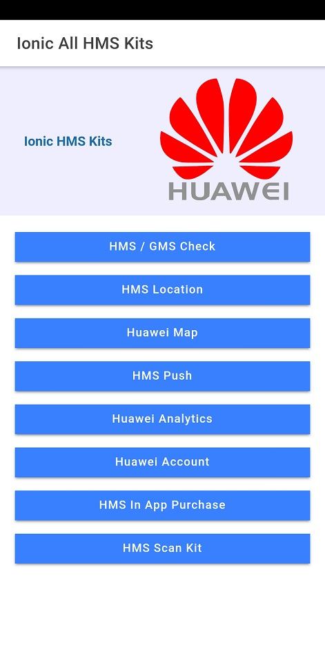
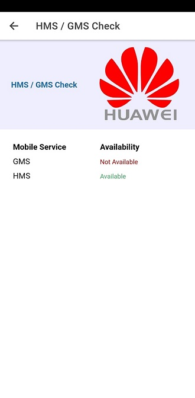
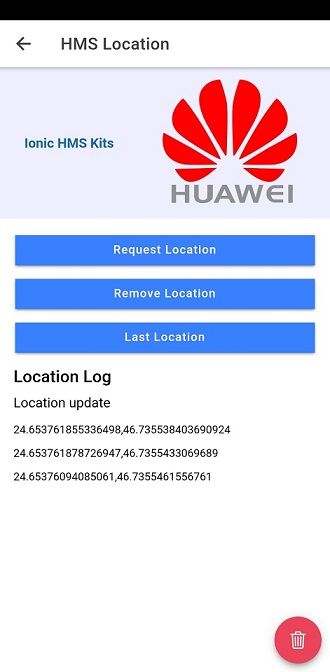
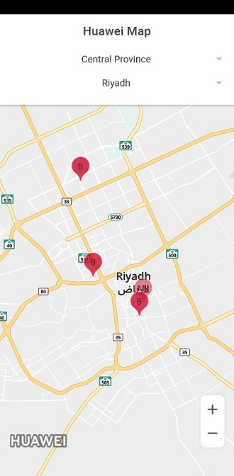
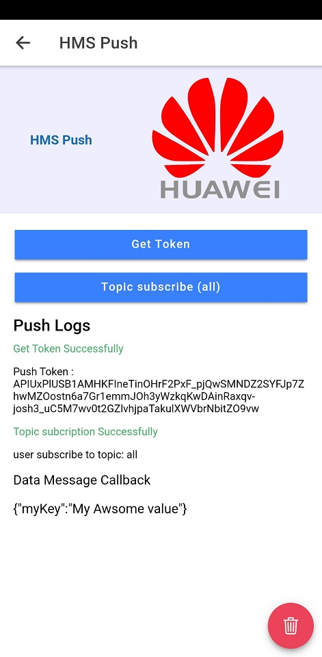
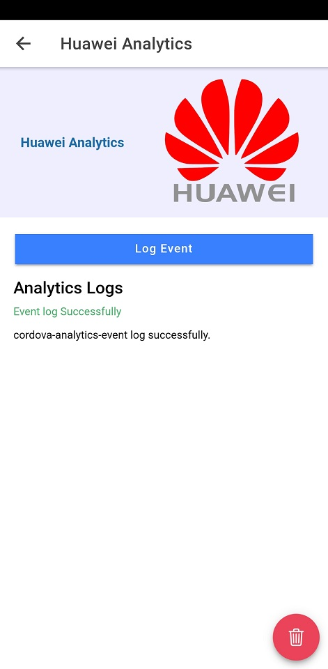
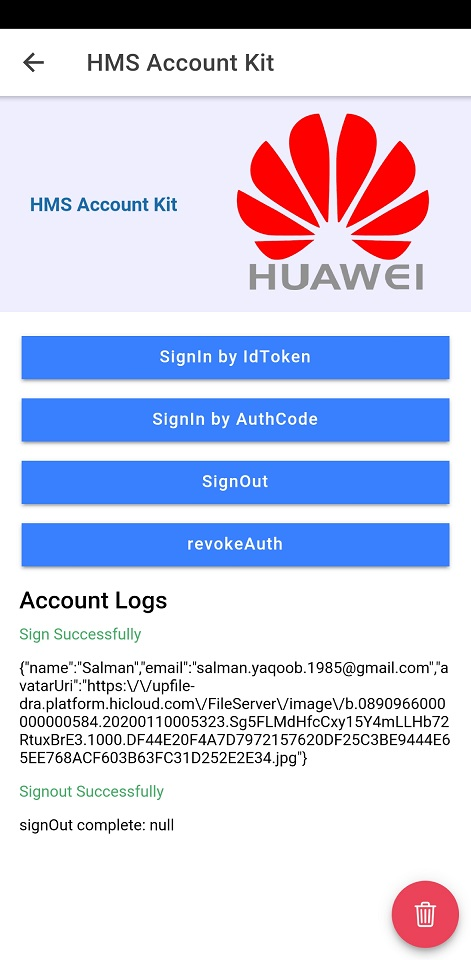
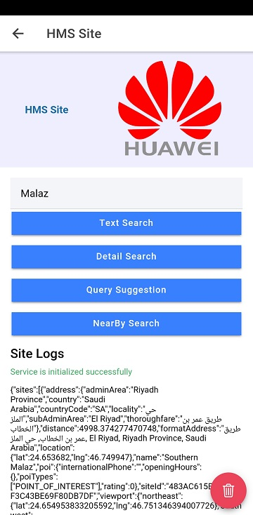
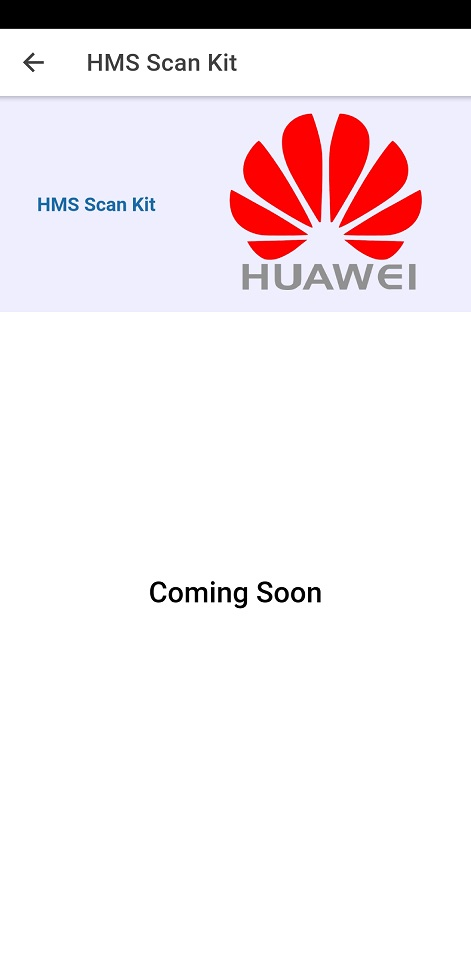

# Ionic All HMS Kits

In this repository we try to combine all **HMS Ionic/Cordova Kits** in one Project!

Ionic HMS packages integrated in this project :

1.  **HMS / GMS Availability Checker.**

2.  **HMS Location Kit.**

3.  **Huawei Web Map.**

4.  **HMS Push Kit.**

5.  **Huawei Analytics Kit.**

6.  **Huawei Account Kit.**

7.  **HMS In App Purchase Kit.** (Coming Soon)

8.  **HMS Site Kit.** (Coming Soon)

## Repository link

[https://github.com/salmanyaqoob/Ionic-All-HMS-Kits](https://github.com/salmanyaqoob/Ionic-All-HMS-Kits)

## Dowload APK

For testing of ionic project, please [donwload](https://github.com/salmanyaqoob/Ionic-All-HMS-Kits/raw/master/apks/ionic-all-hms-release.apk) the apk file.

## Screenshots

### Application

### Screenshots

  

  

  

## Project Guide

### How to create custom Cordova Plugin

#### Install plugman library globally

    npm install plugman -g

#### create custom plugin through plugman

    plugman create --name CordovaHMSPushPlugin --plugin_id com.huawei.cordovahmspushplugin --plugin_version 1.0.0

#### Add android platfrom to plugin

    plugman platform add --platform_name android

#### Add package.json file to plugin

    plugman createpackagejson

#### Add plugin to project

    cordova plugin add ./CordovaPuligns/CordovaHMSPushPlugin/ --link

### Install plugins to Project

    cordova plugin add .\CordovaHMSPlugin\CordovaHMSGMSCheckPlugin
    cordova plugin add .\CordovaHMSPlugin\CordovaHMSLocationPlugin
    cordova plugin add .\CordovaHMSPlugin\cordovaHmsPushPlugin
    cordova plugin add .\CordovaHMSPlugin\CordovaHMSAccountPlugin
    cordova plugin add .\CordovaHMSPlugin\HMSAnalyticsPlugin

### Remove plugins from Project

    cordova plugin remove com.huawei.cordovahmsgmscheckplugin
    cordova plugin remove com.huawei.cordovahmspushplugin
    cordova plugin remove com.huawei.analyticsplugin
    cordova plugin remove com.huawei.cordovahmsaccountplugin
    cordova plugin remove com.huawei.cordovahmslocationplugin

### Run Application on HMS Device

    ionic cordova run android --release -- --buildConfig=build.json
    ionic cordova run android --debug -- --buildConfig=build.json

### Enabling/Disabling the Debug Mode for Analytics

    adb shell setprop debug.huawei.hms.analytics.app <YOUR-PACKAGE-NAME>
    shell setprop debug.huawei.hms.analytics.app .none.

## Official HMS Resources

### HMS All Plugins:

[https://developer.huawei.com/consumer/en/doc/overview/HMS-Core-Plugin](https://developer.huawei.com/consumer/en/doc/overview/HMS-Core-Plugin)

### Huawei Map Kit:

#### Codelab:

[https://developer.huawei.com/consumer/en/codelab/HMSMapKit/index.html#0](https://developer.huawei.com/consumer/en/codelab/HMSMapKit/index.html#0)

#### Document:

[https://developer.huawei.com/consumer/en/doc/development/HMS-Plugin-Guides/introduction-0000001050329204](https://developer.huawei.com/consumer/en/doc/development/HMS-Plugin-Guides/introduction-0000001050329204)

#### Sample Code:

[https://developer.huawei.com/consumer/en/doc/development/HMS-Plugin-Examples/rn-sample-code-0000001050153703](https://developer.huawei.com/consumer/en/doc/development/HMS-Plugin-Examples/rn-sample-code-0000001050153703)

#### Cordova Plugin:

[https://developer.huawei.com/consumer/en/doc/development/HMS-Plugin-Library/cordova-sdk-download-0000001051053652](https://developer.huawei.com/consumer/en/doc/development/HMS-Plugin-Library/cordova-sdk-download-0000001051053652)

### Huawei Location Kit:

#### Codelab:

[https://developer.huawei.com/consumer/en/codelab/HMSLocationKit/index.html#0](https://developer.huawei.com/consumer/en/codelab/HMSLocationKit/index.html#0)

#### Document:

[https://developer.huawei.com/consumer/en/doc/development/HMS-Plugin-Guides/introduction-0000001050140246](https://developer.huawei.com/consumer/en/doc/development/HMS-Plugin-Guides/introduction-0000001050140246)

#### Sample Code:

[https://developer.huawei.com/consumer/en/doc/development/HMS-Plugin-Examples/cordova-sample-code-0000001050142431](https://developer.huawei.com/consumer/en/doc/development/HMS-Plugin-Examples/cordova-sample-code-0000001050142431)

#### Cordova Plugin:

[https://developer.huawei.com/consumer/en/doc/development/HMS-Plugin-Library/cordova-sdk-download-0000001050142491](https://developer.huawei.com/consumer/en/doc/development/HMS-Plugin-Library/cordova-sdk-download-0000001050142491)

### Push Kit:

#### Codelab:

[https://developer.huawei.com/consumer/en/codelab/HMSPushKit/index.html#0](https://developer.huawei.com/consumer/en/codelab/HMSPushKit/index.html#0)

#### Document:

[https://developer.huawei.com/consumer/en/doc/development/HMS-Plugin-Guides/introduction-0000001050135701](https://developer.huawei.com/consumer/en/doc/development/HMS-Plugin-Guides/introduction-0000001050135701)

#### Sample Code:

[https://developer.huawei.com/consumer/en/doc/development/HMS-Plugin-Examples/cordova-sample-code-0000001050135749](https://developer.huawei.com/consumer/en/doc/development/HMS-Plugin-Examples/cordova-sample-code-0000001050135749)

#### Cordova Plugin:

[https://developer.huawei.com/consumer/en/doc/development/HMS-Plugin-Library/cordova-sdk-download-0000001050133798](https://developer.huawei.com/consumer/en/doc/development/HMS-Plugin-Library/cordova-sdk-download-0000001050133798)

#### Push Kit Server Side code SDK:

**Supporting Language** (Java, C#, Python, GoLang, PHP, Node.js)

[https://developer.huawei.com/consumer/en/doc/development/HMS-Examples/push-serverjavasdk](https://developer.huawei.com/consumer/en/doc/development/HMS-Examples/push-serverjavasdk)

### Analytics Kit:

#### Codelab:

[https://developer.huawei.com/consumer/en/codelab/HMSAnalyticsKit-ReactNative/index.html#0](https://developer.huawei.com/consumer/en/codelab/HMSAnalyticsKit-ReactNative/index.html#0)

#### Document:

[https://developer.huawei.com/consumer/en/doc/development/HMS-Plugin-Guides/introduction-0000001050134725](https://developer.huawei.com/consumer/en/doc/development/HMS-Plugin-Guides/introduction-0000001050134725)

#### Sample Code:

[https://developer.huawei.com/consumer/en/doc/development/HMS-Plugin-Examples/cordova-sample-code-0000001050135749](https://developer.huawei.com/consumer/en/doc/development/HMS-Plugin-Examples/cordova-sample-code-0000001050135749)

#### Cordova Plugin:

[https://developer.huawei.com/consumer/en/doc/development/HMS-Plugin-Library/cordova-sdk-download-0000001050133798](https://developer.huawei.com/consumer/en/doc/development/HMS-Plugin-Library/cordova-sdk-download-0000001050133798)

### Huawei Ads Kit:

#### Document:

[https://developer.huawei.com/consumer/en/doc/development/HMS-Plugin-Guides/introduction-0000001050437673](https://developer.huawei.com/consumer/en/doc/development/HMS-Plugin-Guides/introduction-0000001050437673)

#### Sample Code:

[https://developer.huawei.com/consumer/en/doc/development/HMS-Plugin-Examples/cordova-samples-code-0000001050317376](https://developer.huawei.com/consumer/en/doc/development/HMS-Plugin-Examples/cordova-samples-code-0000001050317376)

#### Cordova Plugin:

[https://developer.huawei.com/consumer/en/doc/development/HMS-Plugin-Library/cordova-sdk-download-0000001050973699](https://developer.huawei.com/consumer/en/doc/development/HMS-Plugin-Library/cordova-sdk-download-0000001050973699)

### Huawei In-App Purchases:

#### Document:

[https://developer.huawei.com/consumer/en/doc/development/HMS-Plugin-Guides/introduction-0000001050132986](https://developer.huawei.com/consumer/en/doc/development/HMS-Plugin-Guides/introduction-0000001050132986)

#### Sample Code:

[https://developer.huawei.com/consumer/en/doc/development/HMS-Plugin-Examples/cordova-sdk-download-0000001050133052](https://developer.huawei.com/consumer/en/doc/development/HMS-Plugin-Examples/cordova-sdk-download-0000001050133052)

#### Cordova Plugin:

[https://developer.huawei.com/consumer/en/doc/development/HMS-Plugin-Library/cordova-sdk-download-0000001050133052](https://developer.huawei.com/consumer/en/doc/development/HMS-Plugin-Library/cordova-sdk-download-0000001050133052)

### HMS Site Kit:

#### Document:

[https://developer.huawei.com/consumer/en/doc/development/HMS-Plugin-Guides/introduction-0000001050260022](https://developer.huawei.com/consumer/en/doc/development/HMS-Plugin-Guides/introduction-0000001050260022)

#### Sample Code:

[https://developer.huawei.com/consumer/en/doc/development/HMS-Plugin-Guides/introduction-0000001050260022](https://developer.huawei.com/consumer/en/doc/development/HMS-Plugin-Guides/introduction-0000001050260022)

#### Cordova Plugin:

[https://developer.huawei.com/consumer/en/doc/development/HMS-Plugin-Library/cordova-sdk-download-0000001050426037](https://developer.huawei.com/consumer/en/doc/development/HMS-Plugin-Library/cordova-sdk-download-0000001050426037)

### Note:

This article and repository will update frequently upon new HMS Kits compatibility with Ionic framework.

### Conclusion

This article and repository will be helpful for developers as a kick-start project. Developers can check the project configuration and code and make similar changes in your Ionic project to quickly get up and running for HMS solution.
